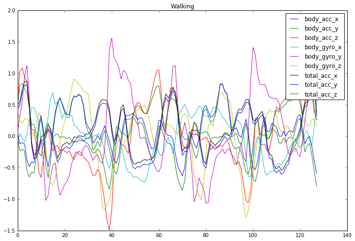
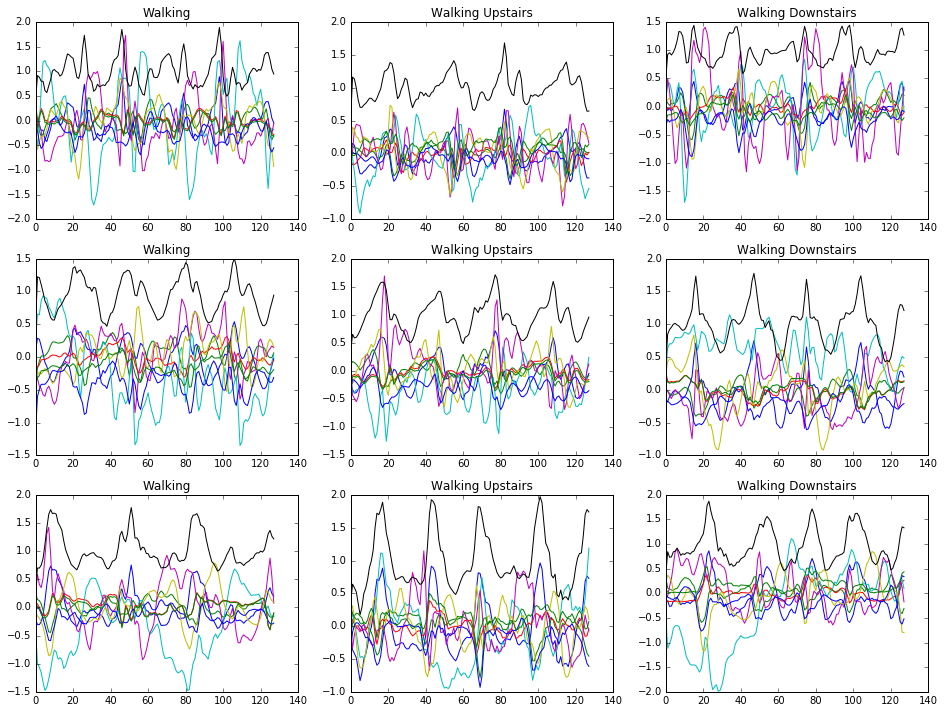

## The Idea

When people are healthier, health insurance companies are wealthier. In this project I do some of the machine learning
work that would be needed to for a health insurance company to create a fitness app. 
There are already many fitness apps. However, an app produced by an an insurance company could provide financial
incentives to exercise, something existing fitness apps cannot do. This incentive will invite fraud, leading to 
an interesting machine learning problem of trying to tell whether or not it was actually the user who was doing
the exercise. We solve this problem by learning a mapping that preserves a user signature[1].

## The Data

Our dataset[2] consists of ~2.5 second recordings of test subjecs performing everyday living activities.
We restricted the data to the walking activities: walking, walking upstairs, and walking downstairs.
Recordings were taken using accellerameters and gyroscopes in a normal cell phone. There were 30 subjects
21 were used as training data and 9 as test data.

Accelerometers and gyros both record along x, y and z axes giving 6 features per timestep and curators of the 
dataset attempted to remove the effect of gravity on the accelerometers giving an additional 3 features called
body acceleration. 

## First Challenge: Activity Classification
### The Model: Convolutional Neural Network
#### Archetecture
#### Filter Visualization
#### Accuracy
Test score: 0.144440290871 (This is cross entropy)
Test accuracy: 0.979091564528
[[491   0   5]
 [  0 447  24]
 [  0   0 420]]
#### Error Investigation
Is it just one test subject that is driving all the error?

## Second Challenge: Fraud Detection

## References
[1] Raia Hadsell, Sumit Chopra and Yann LeCun. Dimensionality Reduction by Learning an Invariant Mapping. 
http://yann.lecun.com/exdb/publis/pdf/hadsell-chopra-lecun-06.pdf

[2] Davide Anguita, Alessandro Ghio, Luca Oneto, Xavier Parra and Jorge L. Reyes-Ortiz. A Public Domain Dataset for Human Activity Recognition Using Smartphones. 21th European Symposium on Artificial Neural Networks, Computational Intelligence and Machine Learning, ESANN 2013. Bruges, Belgium 24-26 April 2013.
https://archive.ics.uci.edu/ml/datasets/Human+Activity+Recognition+Using+Smartphones
