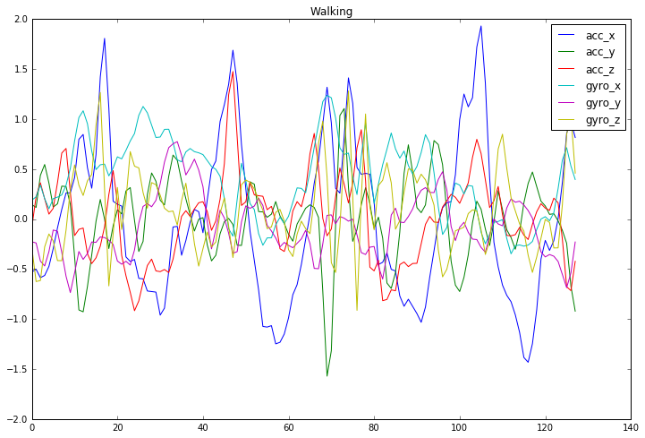
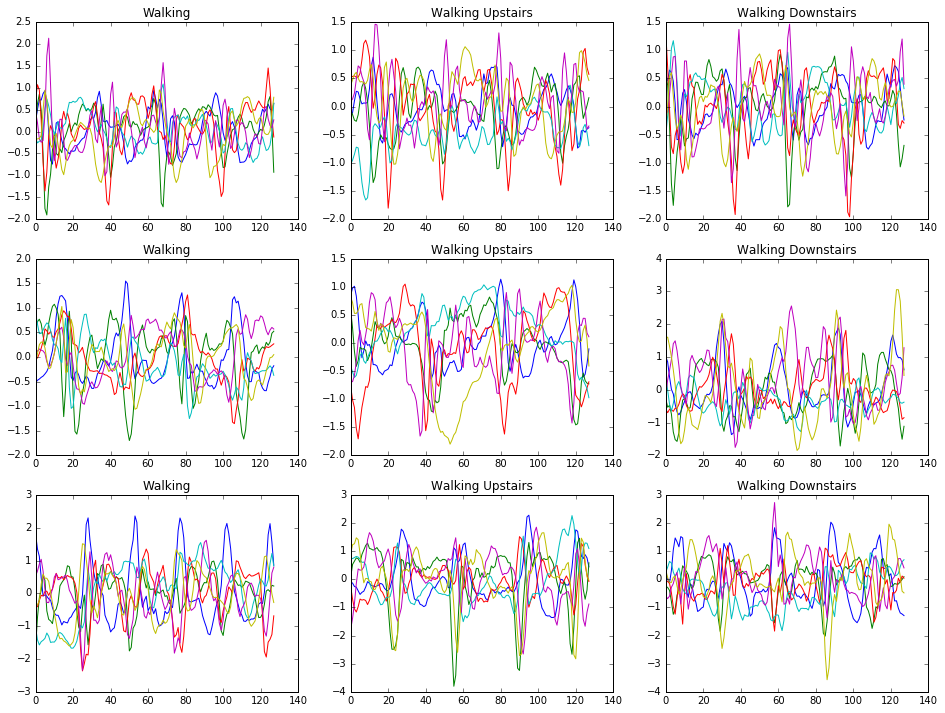

## The Idea

When people are healthier, health insurance companies are wealthier. In this project I do some of the machine learning
work that would be needed to for a health insurance company to create a fitness app. 
There are already many fitness apps. However, an app produced by an an insurance company could provide financial
incentives to exercise, something existing fitness apps cannot do. This incentive will invite fraud, leading to 
an interesting machine learning problem of trying to tell whether or not it was actually the user who was doing
the exercise. We solve this problem by learning a mapping that preserves a user signature[1].

## The Data

Our dataset[2] consists of ~2.5 second recordings of test subjecs performing everyday living activities.
We restricted the data to the walking activities: walking, walking upstairs, and walking downstairs.
Recordings were taken using accellerameters and gyroscopes in a normal cell phone. There were 30 subjects
21 were used as training data and 9 as test data.

Accelerometers and gyros both record along x, y and z axes giving 6 features per timestep and curators of the 
dataset attempted to remove the effect of gravity on the accelerometers giving an additional 3 features called
body acceleration. 

## First Challenge: Activity Classification

## Second Challenge: Fraud Detection

## Requirements
The algorithm must scale to millions of classes

## Challenges
Multi class classification scaling to millions of classes.  Not all classe are known at training time.
A test subject walking upstairs may look very different from a test subject walking downstairs.

The idea is to train a function G_W: X -> V, where V is some vector space and for x_1 and x_2 in X, G_W(x_1) is 
close to G_W(x_2) iff x_1 and x_2 belong to the same class.

## Results
I trained the network on 21 test subjects and tested it on the remaining 9.  
Using the convonet we achieved 94% accuracy telling whether two observations came from the same test
subject or a different test subject.  

## The App
Fitness app for insurance companies.  Measure how much people exercise and give discounts.  Detect when they give their phones to friends to exercise for them and don't give credit.

## References
[1] Raia Hadsell, Sumit Chopra and Yann LeCun. Dimensionality Reduction by Learning an Invariant Mapping. 
http://yann.lecun.com/exdb/publis/pdf/hadsell-chopra-lecun-06.pdf

[2] Davide Anguita, Alessandro Ghio, Luca Oneto, Xavier Parra and Jorge L. Reyes-Ortiz. A Public Domain Dataset for Human Activity Recognition Using Smartphones. 21th European Symposium on Artificial Neural Networks, Computational Intelligence and Machine Learning, ESANN 2013. Bruges, Belgium 24-26 April 2013.
https://archive.ics.uci.edu/ml/datasets/Human+Activity+Recognition+Using+Smartphones
