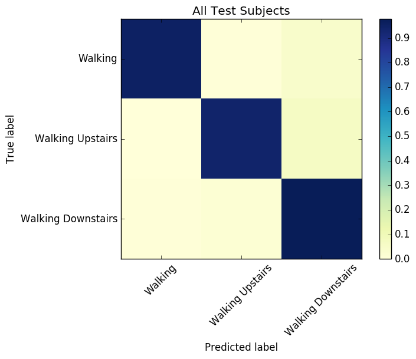

Currently a work in progress, this repo is my final project for the Galvanize Data Science Immersive.

## The Project

When people are healthier, health insurance companies are wealthier. In this project I do some of the machine learning
work that would be needed to for a health insurance company to create a fitness app. 
There are already many fitness apps. However, an app produced by an an insurance company could provide financial
incentives to exercise, something existing fitness apps cannot do. This incentive will invite fraud, leading to 
an interesting machine learning problem of trying to tell whether or not it was actually the user who was doing
the exercise. We solve this problem by learning a mapping that preserves a user signature[1].

## The Data

Our dataset[2] consists of ~2.5 second recordings of test subjecs performing everyday living activities.
We restricted the data to the walking activities: walking, walking upstairs, and walking downstairs.
Recordings were taken using accellerameters and gyroscopes in a normal cell phone. There were 30 subjects
21 were used as training data and 9 as test data.

Accelerometers and gyros both record along x, y and z axes giving 6 features per timestep. Curators of the dataset 
added three additional features per timestep attempting to remove the effect of gravity from the accellerameter data. We achieved better model performance by omitting these features.  

## Activity Classification
The first part of this project is identifying which activity the subject is doing based on the accelerameter and gyro
data. We trained a small Convolutional Neural Network for the task with one output channel for each activity. 
In only a few minutes of training on CPU (most of the time a large GPU is required to train a CNN) we achieved
high accuracy on our classification task.

### The Model: Convolutional Neural Network
#### Archetecture
#### Filter Visualization

The CNN trains filters that are 8 timesteps long and slide along each observation providing an activation value for each point.
These two filters seem to detect steps and seem to be able to distinguish steps on the left from steps on the right.

#### Accuracy

Test score (cross entropy): 0.0458956248169

Test accuracy: 0.984138428262

[[495   0   1]

 [  5 454  12]

 [  2   2 416]]
 

 
#### Error Investigation
Is it just one test subject that is driving all the error?

Yes. Most to all of the error came from subject number 10. 
The neural network sometimes thinks his or her walking upstairs looks like walking downstairs
and occasionally thinks that his her her walking looks like walking downstairs.

Although we had thousands of test observations, remember that these observations all came from 
21 subjects. One reason why we might have had poor prediction accuracy for subject 10 
is that our 21 train subjects may not have been representative of the population.  Perhaps
none, or not enough of our train subjects had a similar enough gait to subject 10.

Question: Do most subjects have higher variance in gyro and for downstairs? 
Does subject 10 have higher variance for all activities?

## Fraud Detection

As soon as we start offering money to people to exercise we will have created a financial incentive for
fraud. It is expected that some users will try to game the system by having their friends exercise for them.
One person could easily carry several phones and go for a jog.  If we allow this kind of behavior customers
will exercise less and everyone loses.

### Identity Preserving Mapping

Inspired by [1] we train an identity preserving mapping from our data to a low dimensional vector space. 
The mapping 'forgets' what activity and how many steps the subject took but preserves a 'signature' representing
the subjects unique gait. We train this mapping using a *contrastive loss function*. 

$$G_W:X -> V$$

## References
[1] Raia Hadsell, Sumit Chopra and Yann LeCun. Dimensionality Reduction by Learning an Invariant Mapping. 
http://yann.lecun.com/exdb/publis/pdf/hadsell-chopra-lecun-06.pdf

[2] Davide Anguita, Alessandro Ghio, Luca Oneto, Xavier Parra and Jorge L. Reyes-Ortiz. A Public Domain Dataset for Human Activity Recognition Using Smartphones. 21th European Symposium on Artificial Neural Networks, Computational Intelligence and Machine Learning, ESANN 2013. Bruges, Belgium 24-26 April 2013.
https://archive.ics.uci.edu/ml/datasets/Human+Activity+Recognition+Using+Smartphones
