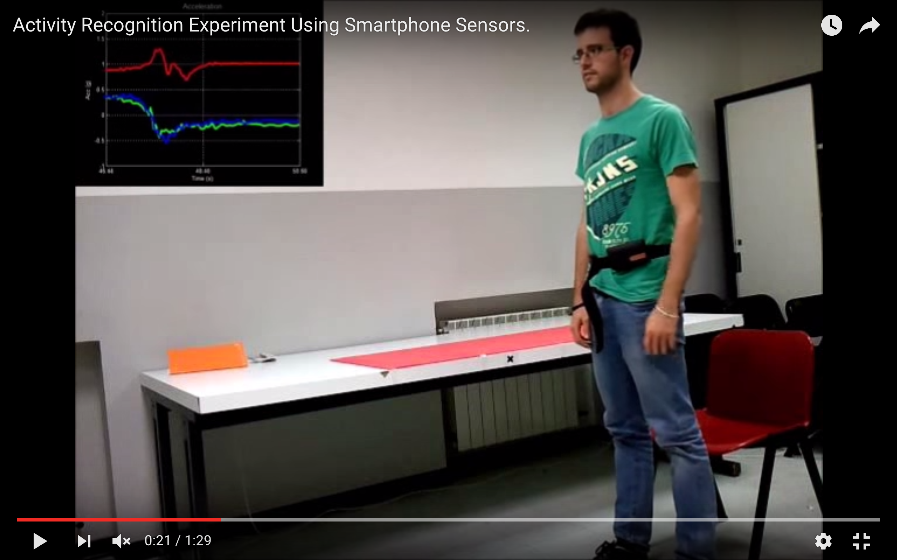
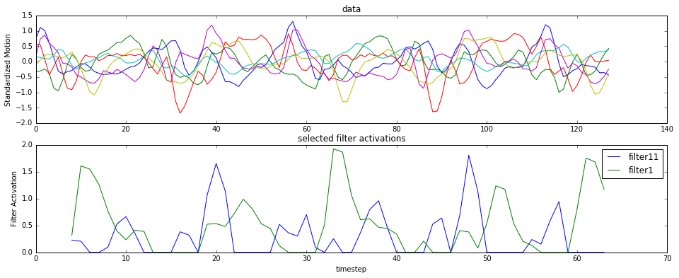
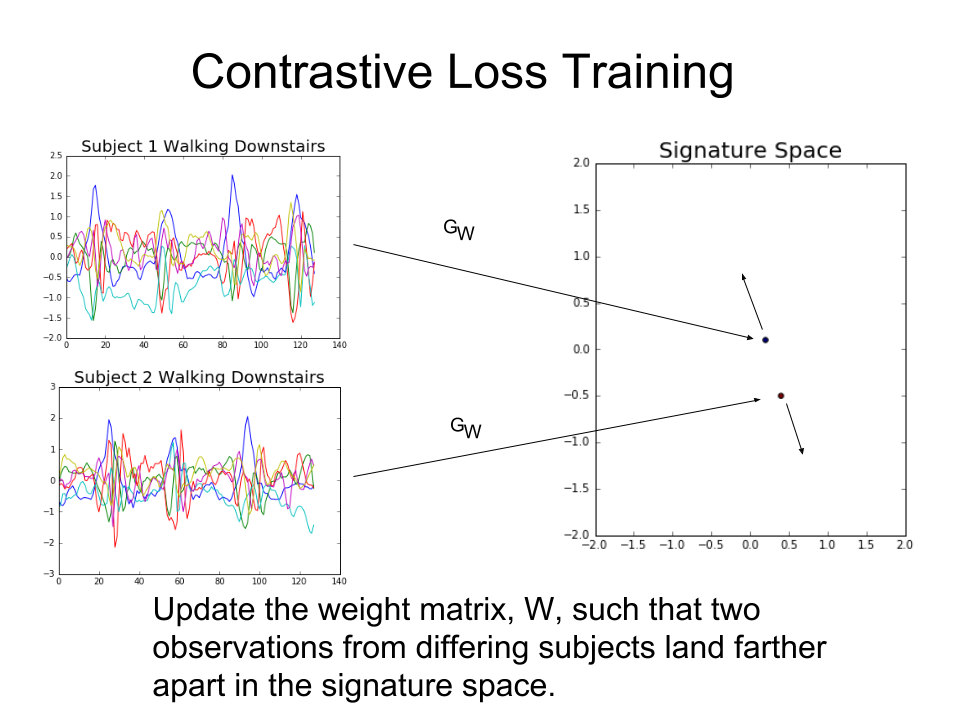

Currently a work in progress, this repo is my final project for the Galvanize Data Science Immersive.

## The Project

When people are healthier, health insurance companies are wealthier. In this project I do some of the machine learning
work that would be needed to for a health insurance company to create a fitness app. 
There are already many fitness apps. However, an app produced by an an insurance company could provide financial
incentives to exercise, something existing fitness apps cannot do. This incentive will invite fraud, leading to 
an interesting machine learning problem of trying to tell whether or not it was actually the user who was doing
the exercise. We solve this problem by learning a mapping that preserves a user signature[1].

## The Data

Our dataset[2] consists of ~2.5 second recordings of test subjecs performing everyday living activities.
We restricted the data to the walking activities: walking, walking upstairs, and walking downstairs.
Recordings were taken using accellerameters and gyroscopes in a normal cell phone. There were 30 subjects
21 were used as training data and 9 as test data.

Accelerometers and gyros both record along x, y and z axes giving 6 features per timestep. Curators of the dataset 
added three additional features per timestep attempting to remove the effect of gravity from the accellerameter data. We achieved better model performance by omitting these features.  

We have 3285 training observations and 1387 test observations.

Subjects wore the phone in a harness around the torso so the phone was in a similar orientation relative to the torso
for all test subjects.

## Activity Classification
The first part of this project is identifying which activity the subject is doing based on the accelerameter and gyro
data. We trained a small Convolutional Neural Network for the task with one output channel for each activity. 
In only a few minutes of training on CPU (most of the time a large GPU is required to train a CNN) we achieved
high accuracy on our classification task.

### The Model: Convolutional Neural Network
#### Archetecture
#### Filter Visualization

The CNN trains filters that are 8 timesteps long and slide along each observation providing an activation value for each point.
These two filters seem to detect steps and seem to be able to distinguish steps on the left from steps on the right.

*These convolutional filters seem to be detecting steps and are able to distinguish right steps from left steps.*

#### Accuracy

Test score (cross entropy): 0.0458956248169

Test accuracy: 0.984138428262

[[495   0   1]

 [  5 454  12]

 [  2   2 416]]
 

 
#### Error Investigation
Most to all of the error came from subject number 10. It can distinguish walking from walking upstairs
well but it gets walking downstairs confused with both other classes.

Although we had thousands of test observations, remember that these observations all came from 
21 subjects. One reason why we might have had poor prediction accuracy for subject 10 
is that our 21 train subjects may not have been representative of the population.  Perhaps
none, or not enough of our train subjects had a similar enough gait to subject 10.

Question: Do most subjects have higher variance in gyro and for downstairs? 
Does subject 10 have higher variance for all activities?

## Fraud Detection

As soon as we start offering money to people to exercise we will have created a financial incentive for
fraud. It is expected that some users will try to game the system by having their friends exercise for them.
One person could easily carry several phones and go for a jog.  If we allow this kind of behavior customers
will exercise less and everyone loses.

### Challenges

We want to add users more quickly than we train new models so we don't have labeled data from all the classes
at training time. (We don't even know what all the classes are at training time!) This means we'll have to use
a different approach from what we did above.

### Identity Preserving Mapping

We train an identity preserving mapping, GW, from our data to a low dimensional vector space, the signature space, using
the *contrastive loss function* described in [1]. We assume we will be able to get at least 1 observation
per user to use as the user signature. (We may need to make it difficult to just install the app on someone
else's phone, but once we know the app is on the right user's phone we can record them walking.) After W is 
trained given observations x1 and x2 we will predict that x1 and x2
are in the same class if ||GW(x1) - GW(x2)|| is small.

### Accuracy

We assume we have one observation, x, from a user (who was not included in the training data) and we need to 
predict whether another observation, y, comes from the same user. We will set some threshold, k, and predict
that x and y come from the same user if ||GW(x) - GW(y)|| < k. Varying k, we obtain an ROC
curve. Our AUC is ???

**TODO: image of the ROC

## Conclusions

There is a lot of information encoded in person's gait, which can be recovered using cell phones and convolutional
neural networks. Other applications for this kind of information may include:

* Diagnosing Parkinsons
* Detecting injuries
* Providing feedback on running form

## References
[1] Raia Hadsell, Sumit Chopra and Yann LeCun. Dimensionality Reduction by Learning an Invariant Mapping. 
http://yann.lecun.com/exdb/publis/pdf/hadsell-chopra-lecun-06.pdf

[2] Davide Anguita, Alessandro Ghio, Luca Oneto, Xavier Parra and Jorge L. Reyes-Ortiz. A Public Domain Dataset for Human Activity Recognition Using Smartphones. 21th European Symposium on Artificial Neural Networks, Computational Intelligence and Machine Learning, ESANN 2013. Bruges, Belgium 24-26 April 2013.
https://archive.ics.uci.edu/ml/datasets/Human+Activity+Recognition+Using+Smartphones

[3] Michael P. O’Donnell, Alyssa B. Schultz, and Louis Yen. The Portion of Health Care Costs Associated With Lifestyle-Related Modifiable Health Risks Based on a Sample of 223,461 Employees in Seven Industries. Journal of occupational and environmental medicine / American College of Occupational and Environmental Medicine. Dec 2015. 

https://www.researchgate.net/publication/286219235_The_Portion_of_Health_Care_Costs_Associated_With_Lifestyle-Related_Modifiable_Health_Risks_Based_on_a_Sample_of_223461_Employees_in_Seven_Industries_The_UM-HMRC_Study

## Commands

STAGE={dev|local|prod|exp} FORCE_TRAIN={true|false} python src/{siamese_model|activity_model}.py

STAGE:

* dev - very small model, just to see if it runs without error
* local - settings for local run
* prod - settings for run on EC2 with GPU
* exp - experimental settings
 
FORCE_TRAIN: 

If false we will attempt to load the model from disk. If true we will train a new model and overwrite the existing model on disk.

To run the tuner:

THEANO_FLAGS=mode=FAST_RUN,device=gpu,floatX=float32 nohup python src/tuner.py
